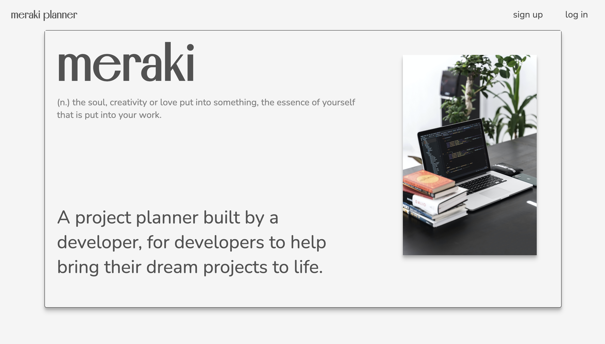
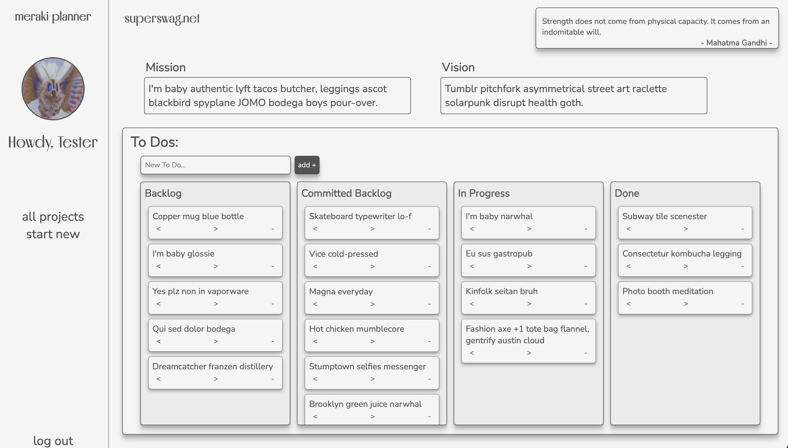
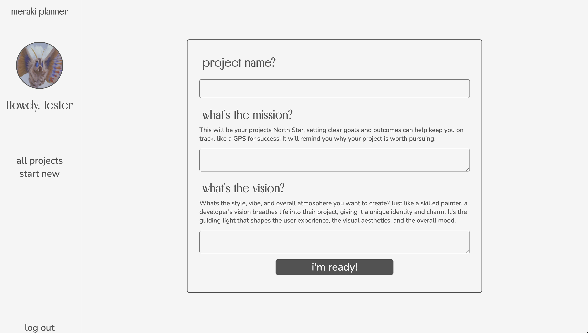

# Meraki Planner

Welcome to Meraki Planner, the ultimate app for developers seeking to turn their dream projects into reality in a motivational and inspiring way. With Meraki Planner, you have access to a comprehensive project planning tool designed to keep you organized, motivated, and driven throughout the entire process. Bringing an idea to life can be challenging and exciting, and this app is here to support you every step of the way.

Meraki Planner offers a user-friendly interface, empowering you to set goals, track progress, and see all your project planning materials in one place. Let Meraki Planner be your trusted companion as you embark on your project journey, and watch as your dreams become tangible realities. Get started today and unlock your full potential with Meraki Planner!

## Author

- [Cass Walters](https://github.com/hicass)

## Tech Stack

**Client:** React, CSS, HTML

**Server:** Node, Express, MongoDB, Mongoose

## Getting Started

[Click here](https://meraki-planner-edee9ada8a4e.herokuapp.com/) for the deployed version!

Check out this projects [Notion Page](https://climbing-port-995.notion.site/Meraki-Planner-5f0a61ab13a6436692154070ccc9e6ed)

## Preview

#### Landing Page:

#### Project Detail Page:

#### New Project Page:

## Future Enhancements 

- Drag and droppable To Do list items
- Pantone Card inspired All Projects Page
- Light/ Dark mode
- Ability to upload project wireframes images
- Ability to upload project ERD images
- Functionality for users to choose their own profile photo
- A user profile page where they can edit their user name and other related user information
- Version of the app thats for general user, and not geared towards developers.
- Wider quote selection

### Unsolved Issues

- Project To Do state rendering not properly set up.
- Very wet code...